# SISTEMA DE PEDIDOS C++

>>> INTERFACES

## PRINCIPAL

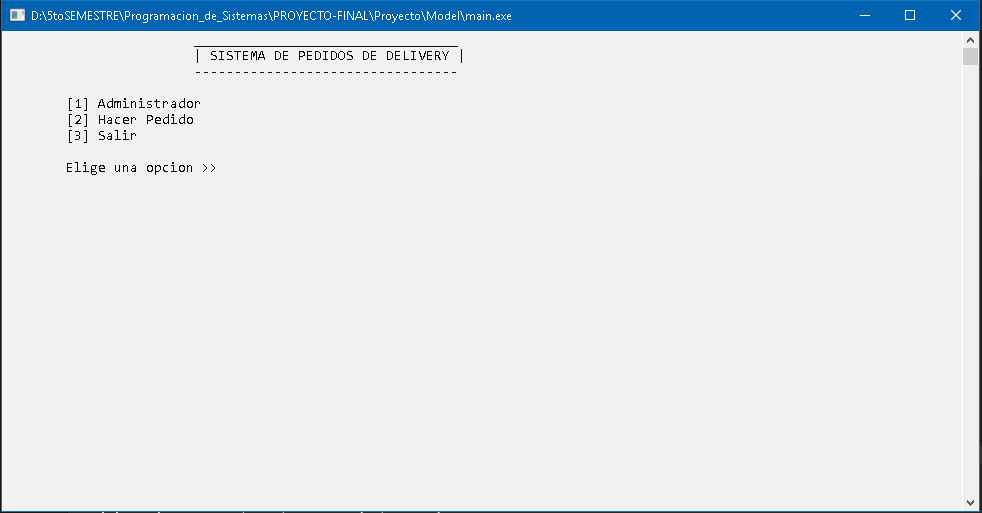

## ADMINISTRADOR

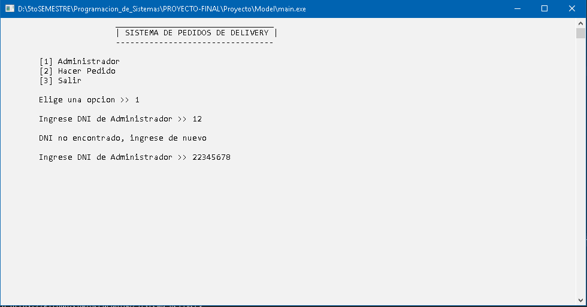
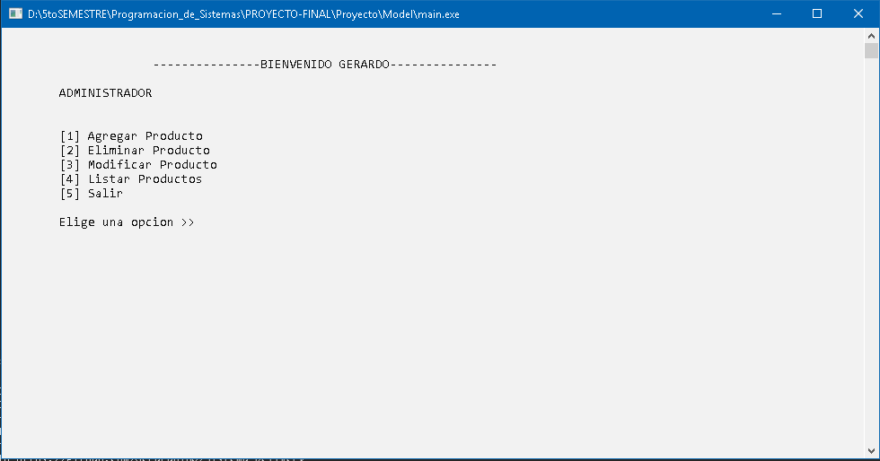

### Lista de Productos

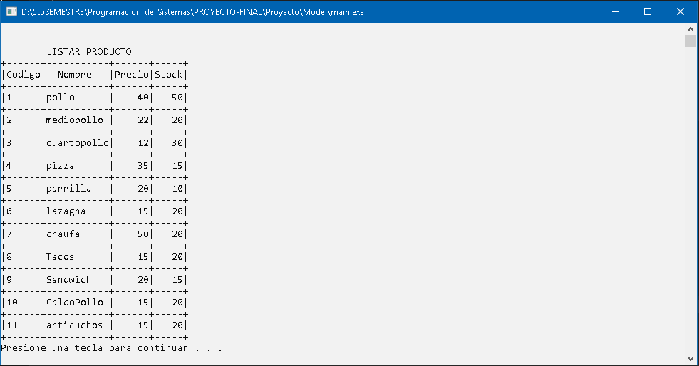

### Eliminar Producto

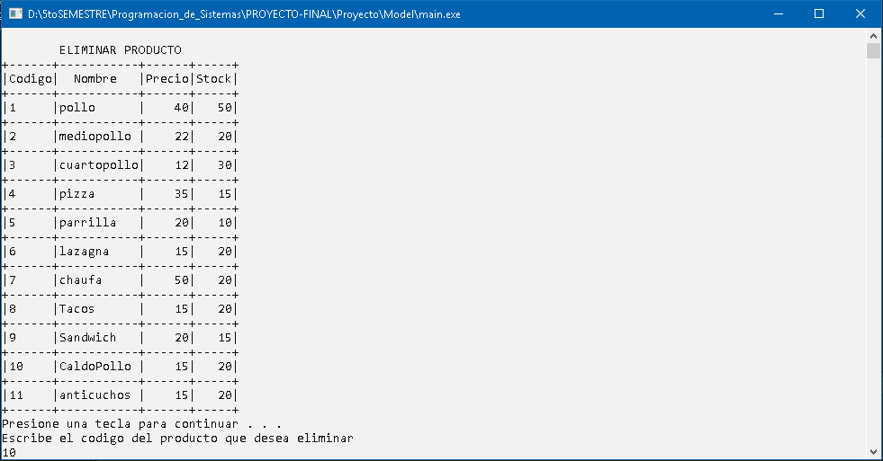

## PEDIDO

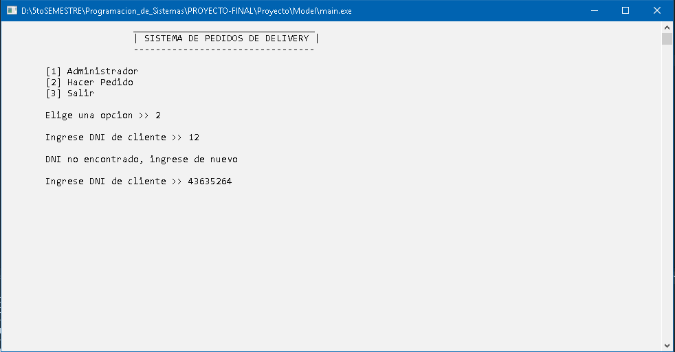
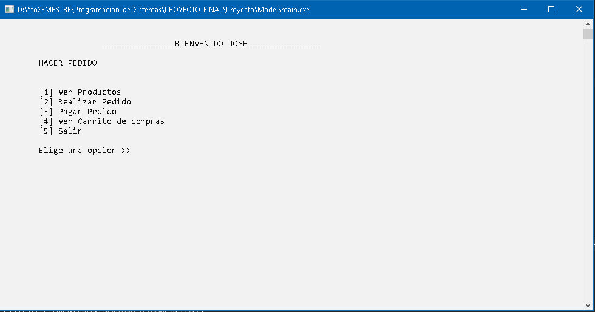

### Realizar Pedido

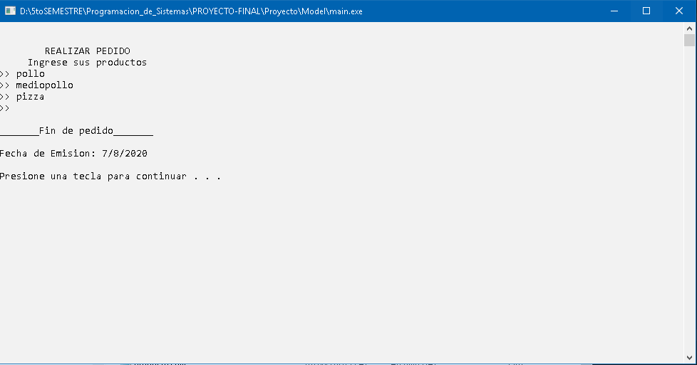

### Carrito de Compras Pedido

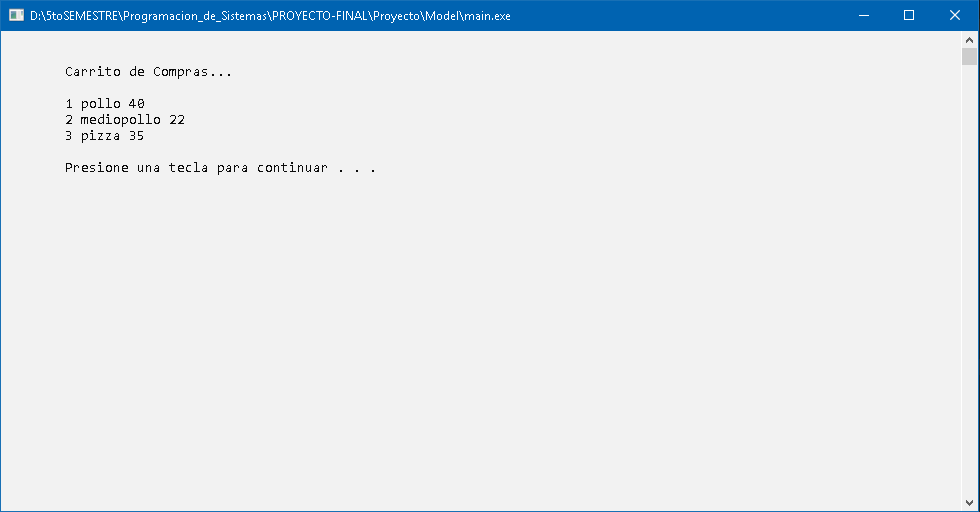

### Boleta de Pedido

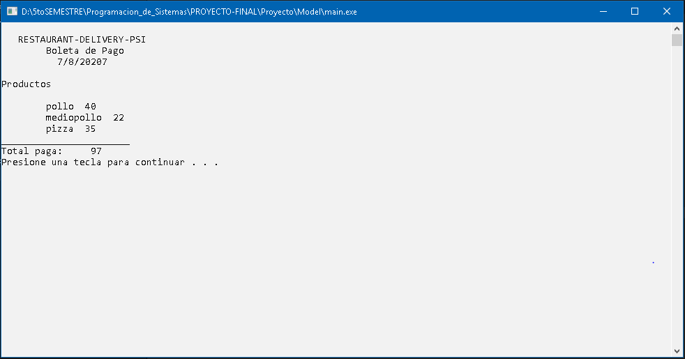

## SALIDA

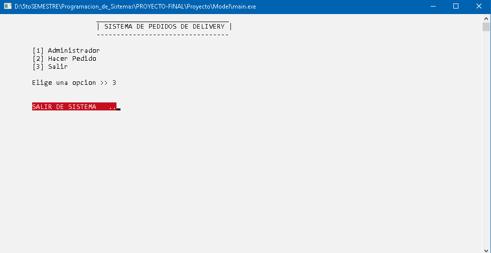